# Отчёт о выполнении задачи "Каршеринг-автомобиль"

- [Отчёт о выполнении задачи "Система управления парком автомобилей"](#отчёт-о-выполнении-задачи-name)
  - [Постановка задачи](#постановка-задачи)
  - [Известные ограничения и вводные условия](#известные-ограничения-и-вводные-условия)
    - [Цели и Предположения Безопасности (ЦПБ)](#цели-и-предположения-безопасности-цпб)
  - [Архитектура системы](#архитектура-системы)
    - [Контекст работы системы](#контекст-работы-системы)
    - [Компоненты](#компоненты)
    - [Алгоритм работы решения](#алгоритм-работы-решения)
    - [Описание Сценариев (последовательности выполнения операций), при которых ЦБ нарушаются](#описание-сценариев-последовательности-выполнения-операций-при-которых-цб-нарушаются)
    - [Переработанная архитектура](#переработанная-архитектура)
    - [Указание "доверенных компонент" на архитектурной диаграмме.](#указание-доверенных-компонент-на-архитектурной-диаграмме)
    - [Проверка негативных сценариев](#проверка-негативных-сценариев)
    - [Политики безопасности](#политики-безопасности)
  - [Запуск приложения и тестов](#запуск-приложения-и-тестов)
    - [Запуск приложения](#запуск-приложения)
    - [Запуск тестов](#запуск-тестов)

## Постановка задачи

Компания разрабатывает подсистему удалённого управления ключевыми функциями для нового легкового автомобиля. Основной сценарий эксплуатации - каршэринг - совместное использование автомобиля широким кругом лиц, которые оплачивают подписку на различные наборы сервисов.

Необходимо обеспечить гибкое управление функционалом автомобиля таким образом, чтобы только аутентичный и авторизованный пользователь мог управлять автомобилем в соответствии со своей подпиской.

Отдельные функции, такие как, например, принудительная блокировка двигателя, отключение освещения, могут привести к аварии и ущербу для жизни и здоровья пассажиров в случае если это происходит во время движения.

Программного обеспечения в системе становится критически много, а сроки разработки сжатые, производителю необходимо выпустить свой автомобиль на рынок быстрее конкурентов, чтобы захватить большую долю рынка.

Необходимо спроектировать систему удалённого управления устойчивой к атакам как снаружи, так и изнутри системы, чтобы снизить требования к производителям сторонних подсистем и собственным разработчикам - это позволит ускорить и удешевить процесс разработки.

В рамках хакатона участникам предлагается:

- доработать предложенную архитектуру (см. далее) автомобиля с учётом целей безопасности
- декомпозировать систему и отделить критический для целей безопасности код
- в ПО нужно внедрить компонент "монитор безопасности" и реализовать контроль взаимодействия всех подсистем управления парком автомобилей
- доработать функциональный прототип
- создать автоматизированные тесты, демонстрирующие работу механизмов защиты

Ценности, ущербы и неприемлемые события

|Ценность|Неприемлемое событие|Оценка ущерба|Комментарий|
|:--|:--|:--|:--|
|Люди-клиенты|в результате критического сбоя в системе управления пострадали клиенты|высокий||
|Другие люди|в результате критического сбоя в системе управления пострадали другие люди (пешеходы, водители других авто)|высокий||
|Автомобиль|в результате критического сбоя в системе управления пострадал автомобиль|средний|Автомобиль застрахован|
|Имущество третьих лиц|в результате критического сбоя в системе управления пострадало имущество третьих лиц / важная инфраструктура|высокий||
|Операционная прибыль|злоумышленники получили неавторизованный доступ к функциям|высокий||

## Известные ограничения и вводные условия

- По условиям организаторов должна использоваться микросервисная архитектура и брокер сообщений для реализации асинхронной работы сервисов.
- Между собой сервисы Системы управления парком автомобилей общаются через брокер сообщений, а все внешнее взаимодействие происходит в виде REST запросов.
- Графический интерфейс для взаимодействия с пользователем не требуется, достаточно примеров REST запросов.

### Цели и Предположения Безопасности (ЦПБ)

Цели безопасности:

1. При любых обстоятельствах поездки осуществляются только авторизованными клиентами
2. При любых обстоятельствах используются только авторизованные услуги
3. При любых обстоятельствах клиентами используются только авторизованные команды
4. При любых обстоятельствах поездки осуществляются с соблюдением скоростных ограничений
5. При любых обстоятельствах поездки осуществляются только в пределах авторизованных районов оказания услуг

## Архитектура системы

### Контекст работы системы

Взаимодействие системы

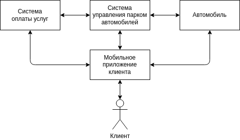

Сценарий работы

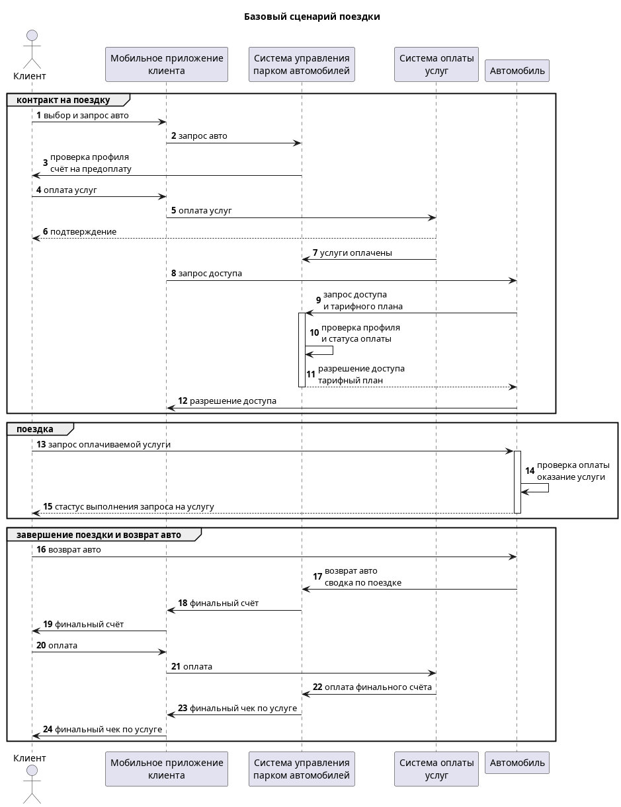

### Компоненты

Базовая архитектура

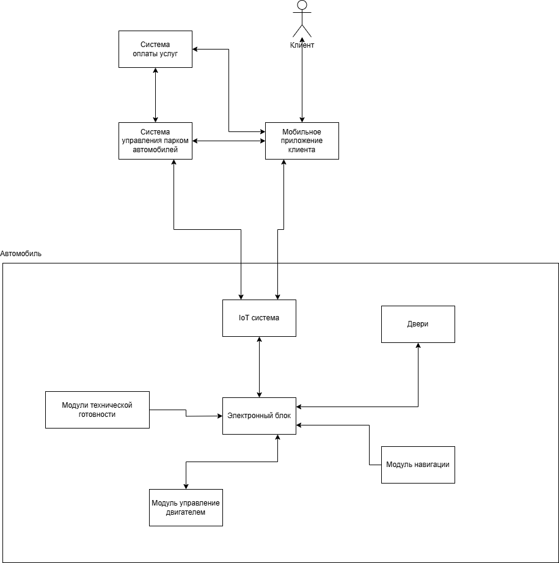

Базовая диаграмма последовательности

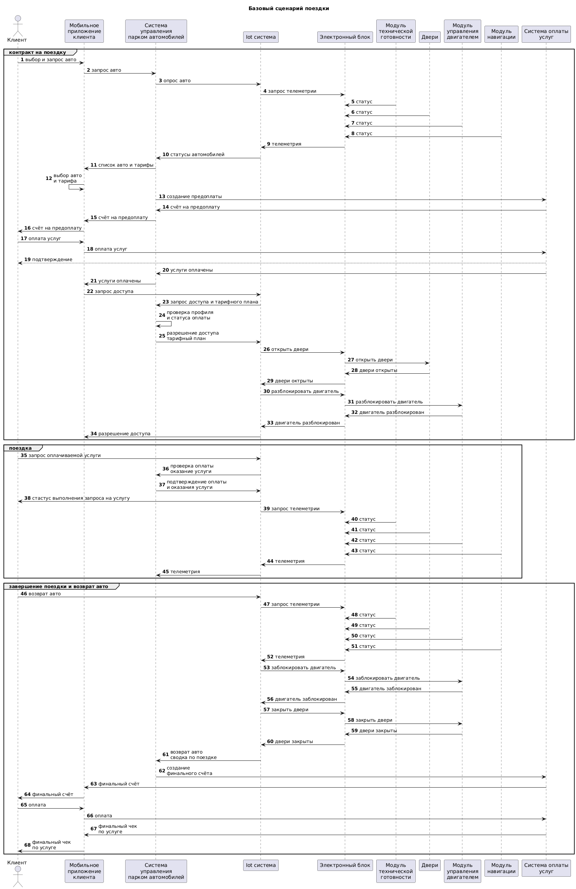

|Компонент|Назначение|
|:--|:--|
|1. IoT Система|Занимается взаимодействием с внутренними и внешними сервисами. На основе полученной информации принимает решения о блокировке или предоставлению доступа к автомобилю, отдаёт команды электроным блокам управления|
|2. Модуль технической готовности|Сообщает электронным блокам информацию о текущем состоянии физических устройств автомобиля|
|3. Модуль управления двигателем|Оперирует состоянием двигателя автомобиля|
|4. Модуль навигации|Получает текущие координаты автомобиля по GPS и отправляет эту информацию в электронные блоки|
|5. Модуль управления дверьми|Открывает и закрывет двери автомобиля|
|6. Электронный блок (eblocks)|Собирает телеметрию автомобиля и отдаёт команды внутренним системам автомобиля. Группа из многих ЭБУ|

### Алгоритм работы решения

### Описание Сценариев (последовательности выполнения операций), при которых ЦБ нарушаются

Нарушение ЦБ (Целей безопасности) в базовом решении

Напоминание ЦБ:

1. При любых обстоятельствах поездки осуществляются только авторизованными клиентами
2. При любых обстоятельствах используются только авторизованные услуги
3. При любых обстоятельствах клиентами используются только авторизованные команды
4. При любых обстоятельствах поездки осуществляются с соблюдением скоростных ограничений
5. При любых обстоятельствах поездки осуществляются только в пределах авторизованных районов оказания услуг

|Атакованный компонент|ЦБ1|ЦБ2|ЦБ3|ЦБ4|ЦБ5|Кол-во нарушений|
|:--|:-:|:-:|:-:|:-:|:-:|:-:|
|IoT Система|🔴|🔴|🔴|🔴|🔴|5/5|
|Модуль технической готовности|🟢|🟢|🟢|🟢|🟢|0/5|
|Модуль управления двигателем|🟢|🔴|🔴|🔴|🟢|3/5|
|Модуль навигации|🟢|🟢|🟢|🟢|🔴|1/5|
|Модуль управления дверьми|🟢|🟢|🔴|🟢|🟢|1/5|
|Электронные блоки управления|🔴|🔴|🔴|🔴|🔴|5/5|


🟢 - ЦБ не нарушена 🔴 - ЦБ нарушена

|Название сценария|Описание|
|---|----------------------|
|НС-1|Модуль управления двигателем был скомпрометирован и не реагировал на блокировку двигателя, что нарушает ЦБ 2, 3, 4|

**Негативный сценарий - НС-1:**

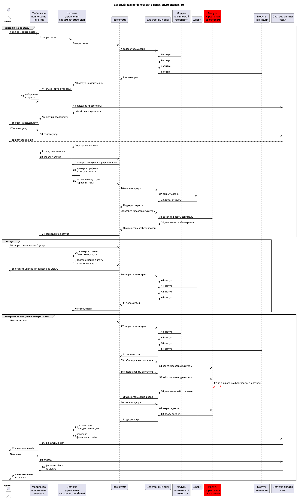

|Название сценария|Описание|
|---|----------------------|
|НС-2|Модуль навигации был скомпрометирован и отправлял недостоверные данные, что нарушает ЦБ 5|

**Негативный сценарий - НС-2:**

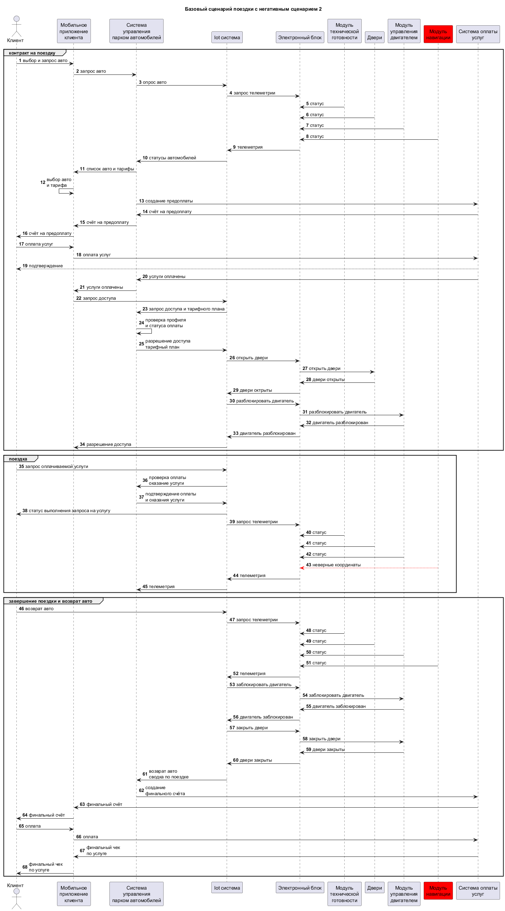

|Название сценария|Описание|
|---|----------------------|
|НС-3|Модуль технической готовности был скомпрометирован и не сообщал о неисправности. Нарушений ЦБ нет|

**Негативный сценарий - НС-3:**

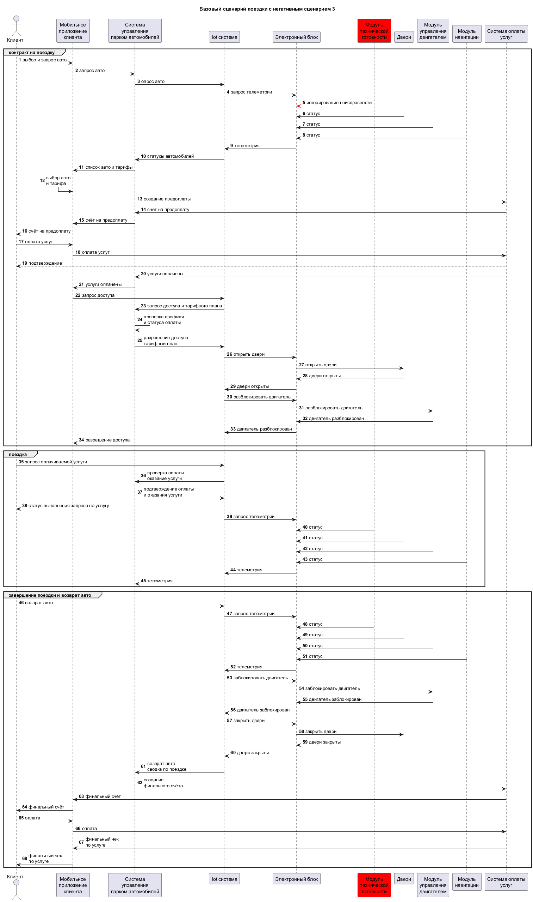

|Название сценария|Описание|
|---|----------------------|
|НС-4|Модуль iot-системы был скомпрометирован и подменял принимаемые комманды, что нарушает ЦБ 1,2,3,4,5|

**Негативный сценарий - НС-4:**

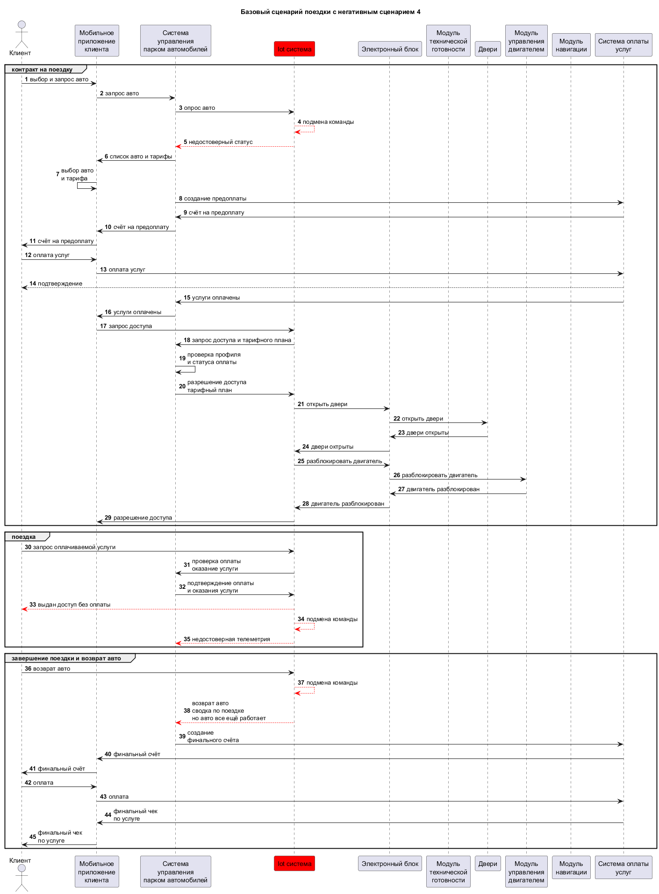

|Название сценария|Описание|
|---|----------------------|
|НС-5|Модуль электронных блоков управления был скомпрометирован и подменял принимаемые комманды, что нарушает ЦБ 1,2,3,4,5|

**Негативный сценарий - НС-5:**

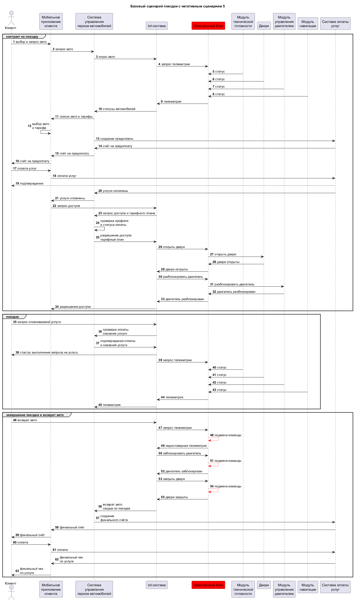

## Переработанная архитектура

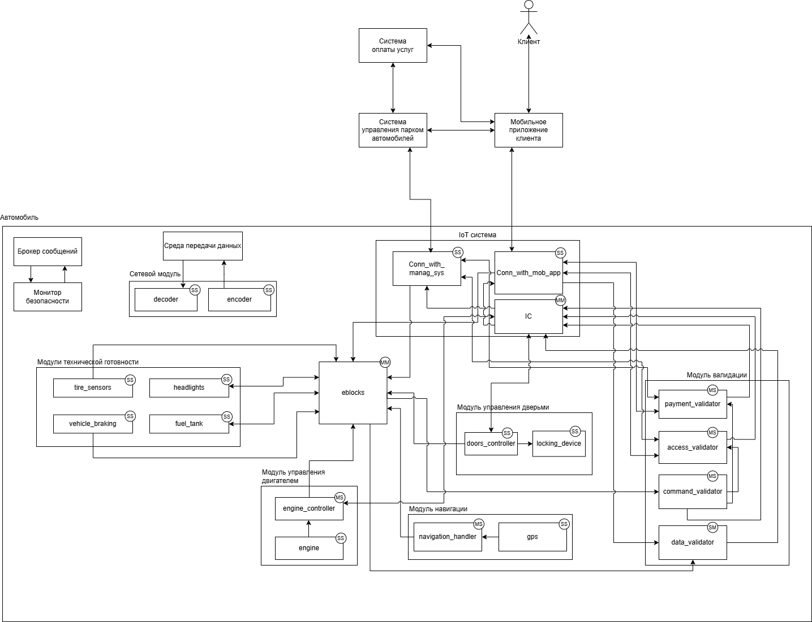

### Таблица новых компонентов

|Компонент|Описание|Комментарий|
|:---|:--|:--|
|7. conn_with_manag_sys|Принимает запрос от системы управления парком автомобилей и отправляет запросы системе управления парком автомобилей|Формирует запрос и передаёт ответы дальше, тело запроса и ответа шифровано|
|8. conn_with_mob_app|Принимает запрос от мобильного приложения и отправляет запросы мобильному приложению||Формирует запрос и передаёт ответы дальше, тело запроса и ответа шифровано|
|9. encoder|Шифрует канал между внешнийими модулями и автомобилем|Шифрование канала|
|10. decoder|Расшифровывеет пакеты от внешних модулей|Шифрование канала|
|11. command_validator|Валидирует команды отправленные eblocks модулем, проверка на корректность, логическая последовательность. Отправляет запрос на подтверждение оплаты и доступа другим валидаторам|Отправляет 0 или 1 в IC взависимости от правдоподобности команды|
|12. access_validator|Валидирует токен доступа, запрашивает/получает токены от системы управления парком автомобилей и мобильного приложения клиента и сравнивает для разрешения вопроса доступа, проверяет доступ к запрашиваемой команде|Отправляет 0 или 1 в IC взависимости от наличия доступа|
|13. payment_validator|Валидирует оплату, запрашивает/получает чеки от системы управления парком автомобилей и мобильного приложения клиента и сравнивает чеки|Отправляет 0 или 1 в IC взависимости от наличия оплаты|
|14. data_validator|Получает телеметрию от eblocks и получает телеметрию от мобильного приложения, сравнивает правдоподобность данных о геолакации, скорости,  также правдобность телеметрии автомобиля|Отправляет 0 или 1 в IC взависимости от правдоподобности телеметрии|
|15. IC|Главное принимающее решение устройство, открывает/закрывает двери, блокирует/разблокирует двигатель, оптравляет данные на мобильное приложение и на систему управления парком автомобилей. Если все в порядке и нет нарушей ЦБ или угроз для описанных ценностей, то пропускает команды, которые отправляет eblocks|Принимает решения на основе данных от валидаторов, может заблокировать двигатель во время поездки (нет возможности набирать скорость), если клиент не реагирует на предупреждения о безопасности (скорость, геолокация, другие системы автомобиля), после 3 предупреждений. Самостоятельно управляет важными комплектующими автомобиля. При наличии неисправности отправляет уведомление пользователю, при наличии монитора в машине уведомление можно выводить туда|
|16. tire_sensors|Измеряет давоение в шинах|Отправляет данные в eblocks|
|17. vehicle_braking|Тормозная система|Отправляет данные в eblocks|
|18. fuel_tank|Топливный бак, управляется eblocks|Отправляет данные в eblocks|
|19. headlights|Фары, управляет eblocks|Отправляет данные в eblocks|
|20. engine_controller|Контроллер двигателя. Блокирует/разблокирует работу двигателя для режима поездки, режим прогрева доступен всегда. Перенаправляет данные с engine на eblocks|Связан физически с двигателем, блокирует двигатель физически, управляется IC. Проверяет сработал ли блокировка|
|21. engine|Двигатель|Передаёт данные о своем состоянии IC, физически взаимодейтсвует с engine_controller|
|22. doors_controller|Контролирует замок дверей. Проверяет сработал ли замок|Отдаёт указания замку дверей, проверяет закрыты ли двери и отправляет данные на IC|
|23. locking_device|Дверной замок|Принимает команды от doors_controller|
|24. navigation_handler|Обрабатывает данные от gps.|Передает данные в eblocks|
|25. gps|GPS трекер|Определяет местоположение автомобиля|

### Диаграмма последовательности

#### Выполнение базового сценария

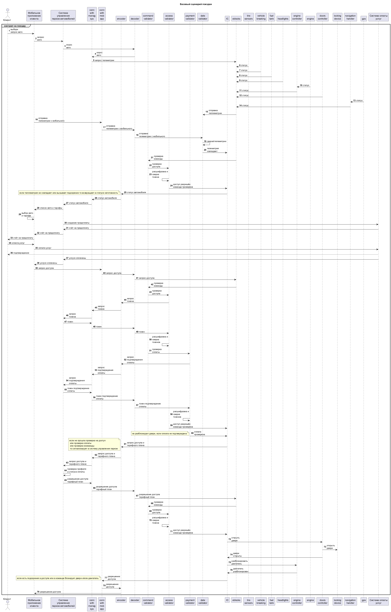
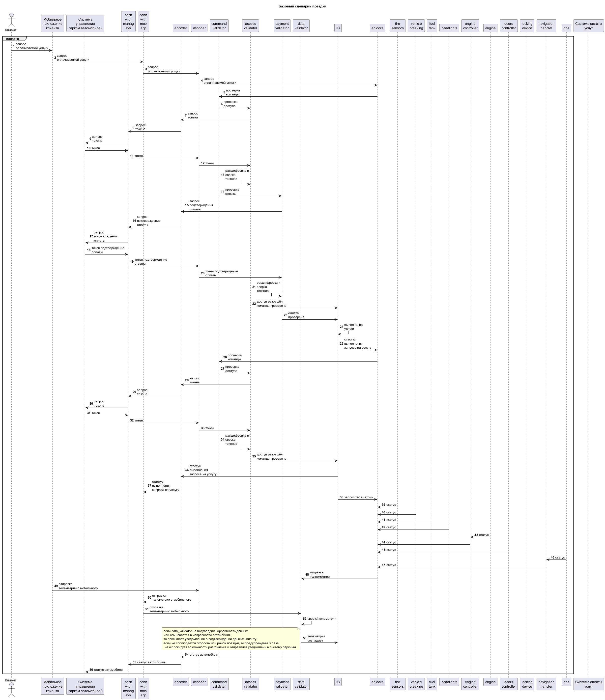
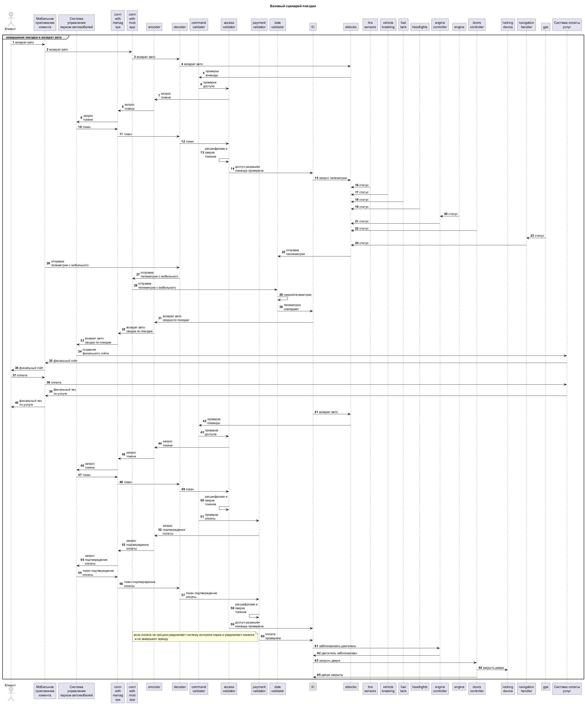

## Указание "доверенных компонент" на архитектурной диаграмме

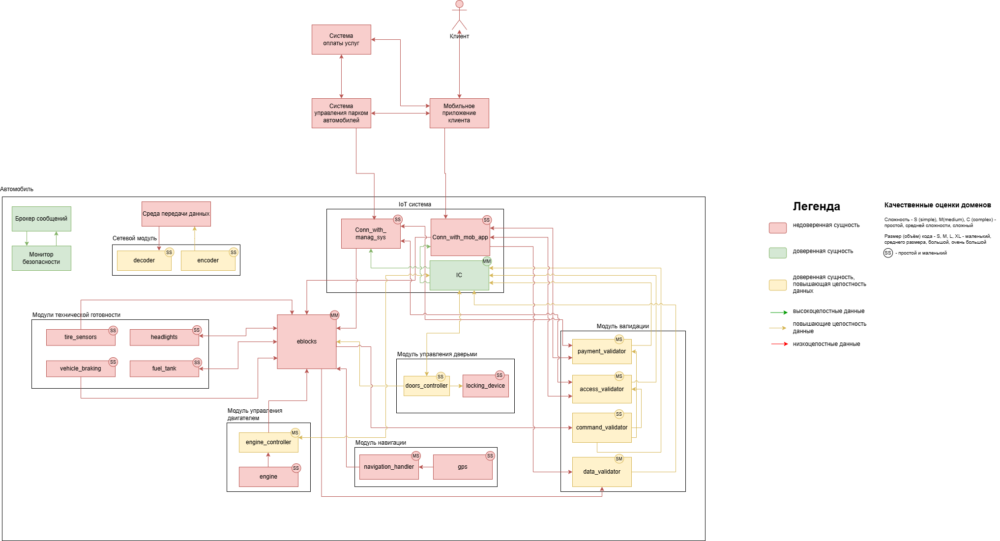

#### Таблица доверенных компонентов

| Компонент              | Уровень доверия                           | Обоснование                 | Комментарий                                                          |
|:-----------------------|:------------------------------------------|:----------------------------|:---------------------------------------------------------------------|
| 1. conn_with_manag_sys | $\textcolor{red}{\textsf{Недоверенный}}$  |                             |                                                                      |
| 2. conn_with_mob_app   | $\textcolor{red}{\textsf{Недоверенный}}$  |                             |                                                                      |
| 3. IC                  | $\textcolor{green}{\textsf{Доверенный}}$  | Соблюдение ЦБ 1, 2, 3, 4, 5 | Согласовывает наличие доступа и оплаты, корректность команд и данных |
| 4. tire_sensors        | $\textcolor{red}{\textsf{Недоверенный}}$  |                             |                                                                      |
| 5. headlights_status   | $\textcolor{red}{\textsf{Недоверенный}}$  |                             |                                                                      |
| 6. fuel_status         | $\textcolor{red}{\textsf{Недоверенный}}$  |                             |                                                                      |
| 7. vehicle_braking     | $\textcolor{red}{\textsf{Недоверенный}}$  |                             |                                                                      |
| 8. engine_controller   | $\textcolor{orange}{\textsf{Доверенный}}$ | Соблюдение ЦБ 2, 3, 4       | Отвечает за доступ к двигателю                                       |
| 9. engine              | $\textcolor{red}{\textsf{Недоверенный}}$  |                             |                                                                      |
| 10. navigation_handler | $\textcolor{red}{\textsf{Недоверенный}}$  |                             |                                                                      |
| 11. gps                | $\textcolor{red}{\textsf{Недоверенный}}$  |                             |                                                                      |
| 12. doors_controller   | $\textcolor{orange}{\textsf{Доверенный}}$ | Соблюдение ЦБ 2, 3          | Отвечает за доступ к дверям                                          |
| 13. locking_device     | $\textcolor{red}{\textsf{Недоверенный}}$  |                             |                                                                      |
| 14. data_validator     | $\textcolor{orange}{\textsf{Доверенный}}$ | Соблюдение ЦБ 4, 5          | Проверяет корректность данных                                        |
| 15. command_validator  | $\textcolor{orange}{\textsf{Доверенный}}$ | Соблюдение ЦБ 3             | Проверяет корректность команд                                        |
| 16. access_validator   | $\textcolor{orange}{\textsf{Доверенный}}$ | Соблюдение ЦБ 1             | Проверяет наличие доступа                                            |
| 17. payment_validator  | $\textcolor{orange}{\textsf{Доверенный}}$ | Соблюдение ЦБ 2             | Проверяет оплату                                                     |
| 18. eblocks            | $\textcolor{red}{\textsf{Недоверенный}}$  |                             |                                                                      |
| 19. decoder            | $\textcolor{orange}{\textsf{Доверенный}}$ | Соблюдение ЦБ 1, 2, 3       | Шифрование каналов                                                   |
| 20. encoder            | $\textcolor{orange}{\textsf{Доверенный}}$ | Соблюдение ЦБ 1, 2, 3       | Шифрование каналов                                                   |

#### Качественная оценка доменов

|Компонент|Уровень доверия|Оценка|Кол-во входящих интерфейсов|Комментарий|
|:--|:-:|:-:|:-:|:--|
|1. conn_with_manag_sys|$\textcolor{red}{\textsf{Недоверенный}}$|SS|5||
|2. conn_with_mob_app|$\textcolor{red}{\textsf{Недоверенный}}$|SS|3||
|3. IC|$\textcolor{green}{\textsf{Доверенный}}$|MM|6||
|4. tire_sensors|$\textcolor{red}{\textsf{Недоверенный}}$|SS|0||
|5. headlights_status|$\textcolor{red}{\textsf{Недоверенный}}$|SS|0||
|6. fuel_status|$\textcolor{red}{\textsf{Недоверенный}}$|SS|0||
|7. vehicle_braking|$\textcolor{red}{\textsf{Недоверенный}}$|SS|0||
|8. engine_controller|$\textcolor{orange}{\textsf{Доверенный}}$|MM|2|Устройство физически блокирующее двигатель|
|9. engine|$\textcolor{red}{\textsf{Недоверенный}}$|SS|0||
|10. navigation_handler|$\textcolor{red}{\textsf{Недоверенный}}$|MM|1||
|11. gps|$\textcolor{red}{\textsf{Недоверенный}}$|SS|0||
|12. doors_controller|$\textcolor{orange}{\textsf{Доверенный}}$|MM|1|Устройство управляющее замком дверей и проверяющее закрыт ли двери|
|13. locking_device|$\textcolor{red}{\textsf{Недоверенный}}$|SS|1||
|14. data_validator|$\textcolor{orange}{\textsf{Доверенный}}$|MS|2|Програмный валидатор соотносящий данные телеметрии с телефона пользователя и gps авто, а также проверяющий телеметрию на адекватные показатели и неисправность|
|15. command_validator|$\textcolor{orange}{\textsf{Доверенный}}$|MS|3|Програмный валидатор проверяющий корректность команд и их последовательность|
|16. access_validator|$\textcolor{orange}{\textsf{Доверенный}}$|MS|3|Програмный валидатор проверяющий соответствие токена доступа в системе управления парком автомобилей и мобильного приложения|
|17. payment_validator|$\textcolor{orange}{\textsf{Доверенный}}$|MS|3|Програмный валидатор проверяющий соответствие id чека и данных чека от мобильного приложения и системы управления парком автомобилей|
|18. eblocks|$\textcolor{red}{\textsf{Недоверенный}}$|MM|7||
|19. decoder|$\textcolor{orange}{\textsf{Доверенный}}$|SS|1|Алгоритм расшифровки получаемых данных|
|20. encoder|$\textcolor{orange}{\textsf{Доверенный}}$|SS|0|Алгоритм шифрования исходящих данных|


### Проверка негативных сценариев

### Проверка негативных сценариев

|Название сценария|Описание|
|---|---------|
|НС-1|Тест Негативного сценария 1. Двигатель был скомпрометирован, но так как ввёден модуль engine_controller контролирующий блокировку/разблокировку двигателя на физическом уровне, то попытки запустить двигатель окажутся неуспешными, ЦБ не нарушаются|

**Негативный сценарий - НС-1:**

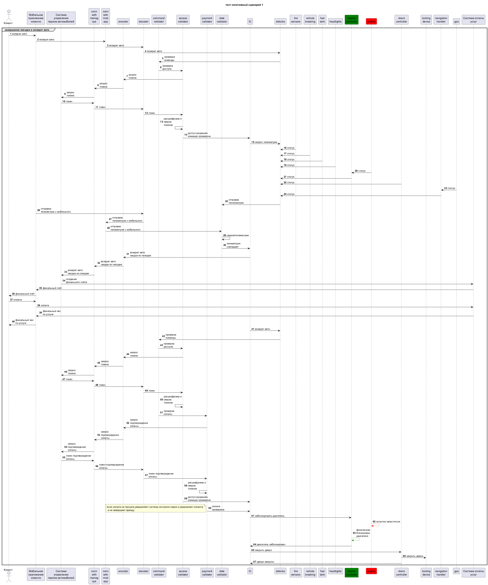

|Название сценария|Описание|
|---|---------|
|НС-2|Тест Негативного сценария 2. GPS был скомпрометирован, но так как ввёден модуль data_validator сопостовляющий данные о скорости и геолокации gps авто с gps мобильного клиента, то попытки выехать за район разрешенного передвижения окажутся неуспешными, так как либо пользваель подтвердит своё местоположение, либо двигатель заблокируется и авто не сможет набирать скорость, ЦБ не нарушаются|

**Негативный сценарий - НС-2:**

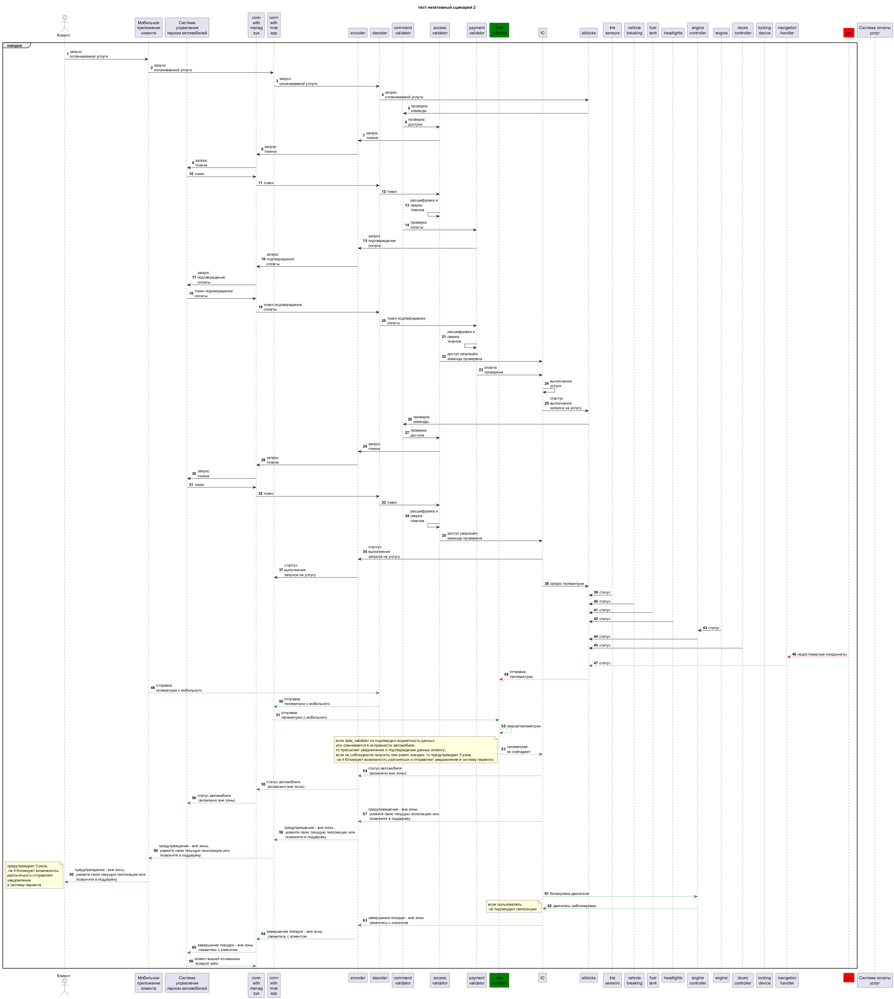
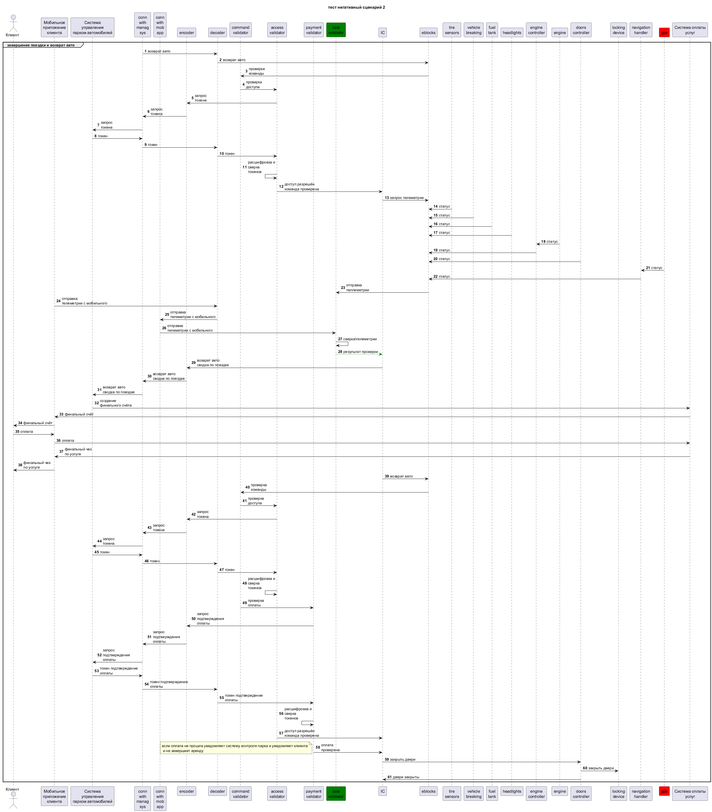

|Название сценария|Описание|
|---|---------|
|НС-4|Тест Негативного сценария 4. Связь с мобильны приложением была скопромитирована и предположительно шифрование было взломано, но так как ввёден модуль access_controller контролирующий проверку доступа к автомобилю и командам, то попытки атак типа man in the middle отражены. Валидатор связывается с системой управления парком автомобилей и проверяет есть ли такой пользователь и запрашивал ли он доступ к автомобилю. ЦБ не нарушаются|

**Негативный сценарий - НС-4:**

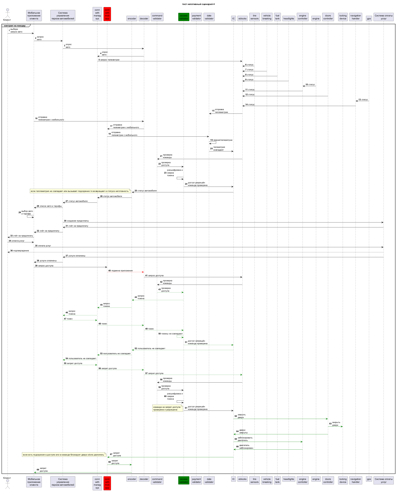

|Название сценария|Описание|
|---|---------|
|НС-4-1|Тест Негативного сценария 4. Связь с системой управлления парком автомобилей была скопромитирована и предположительно шифрование было взломано, но так как ввёден модуль payment_controller контролирующий проверку оплаты, то попытки атак типа man in the middle отражены. Валидатор связывается с системой управления парком автомобилей и проверяет, что полученный ранее чек от мобильного клиента совпадает с чеком от системы управления парком автомобилей. ЦБ не нарушаются|

**Негативный сценарий - НС-4-1:**

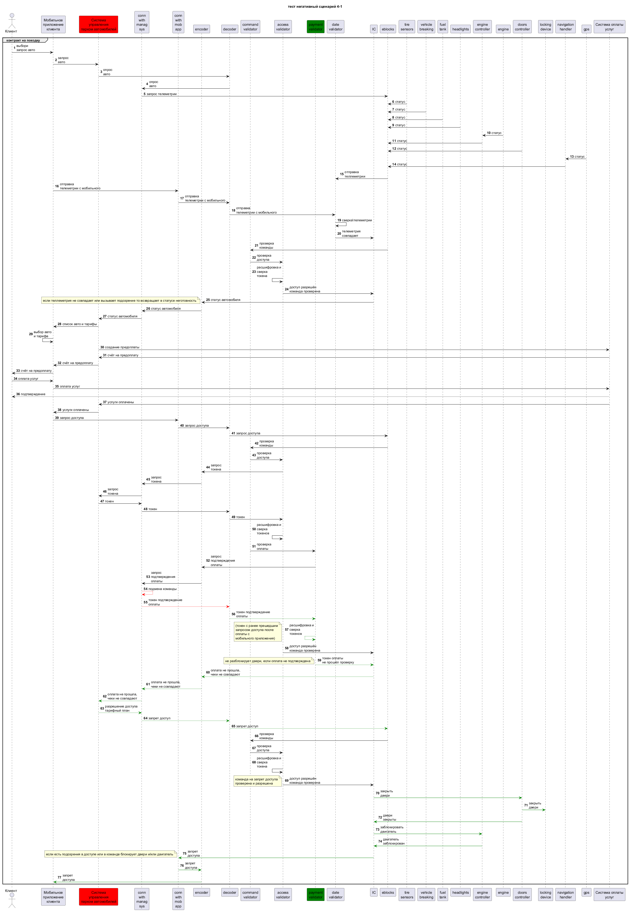

|Название сценария|Описание|
|---|---------|
|НС-5|Тест Негативного сценария 5. eblocks скопромитирован, но так как ввёден модуль command_validator контролирующий проверку команды и логическую послледовательность, и access_validator контролирующий доступ пользователя к команде и к машине, который связывается с системой управления парком автомобилей, а также возможность IC соотносить отправленную команду и полученную проверенную, то попытки подменить команды предотвращены. IC сразу сообщает о неисрпавности и прекращает поездку в течении 15 минут. ЦБ не нарушаются|

**Негативный сценарий - НС-5:**

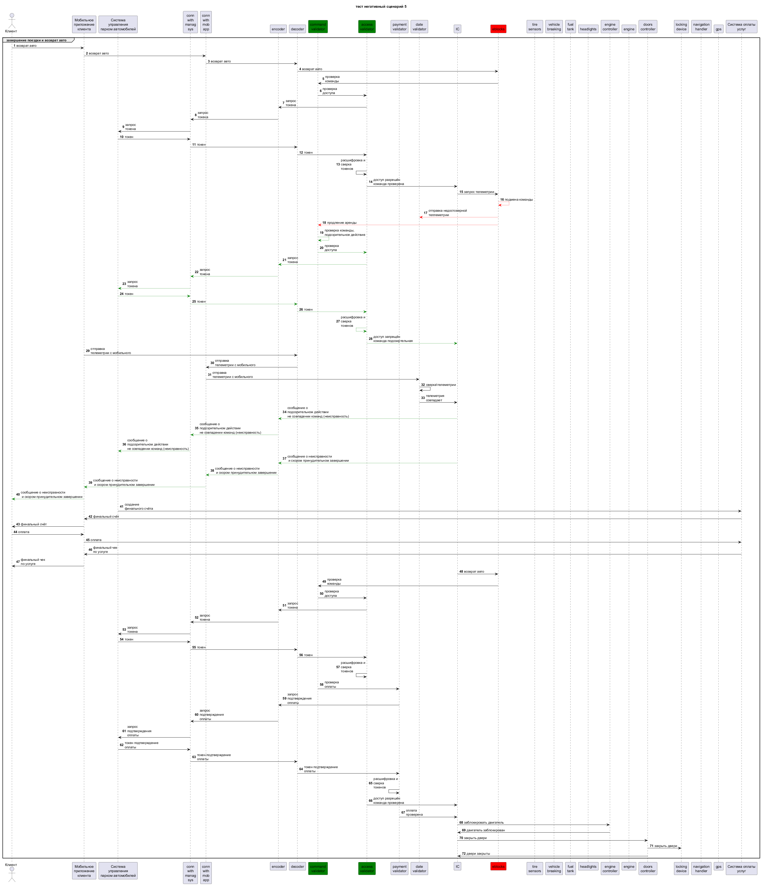


|Компонент|Соответствие|
|-----|-----|
|Система управления парком автомобилей|managment-system|
|Система оплаты услуг|payment-system|
|Мобильное приложение клиента|mobile-client|

Остальные программные модули соответсвуют названиям компонент в схеме

### Политики безопасности

```python {lineNo:true}
# Политики безопасности
policies = (
    # IoT Система
    {"src": "conn_with_manag_sys", "dst": "command_validator"},
    {"src": "eblocks", "dst": "conn_with_manag_sys"},
    {"src": "park_management_system", "dst": "conn_with_manag_sys"},
    {"src": "conn_with_manag_sys", "dst": "park_management_system"},
    {"src": "payment_validator", "dst": "conn_with_manag_sys"},
    {"src": "conn_with_manag_sys", "dst": "payment_validator"},
    {"src": "acccess_validator", "dst": "conn_with_manag_sys"},
    {"src": "conn_with_manag_sys", "dst": "acccess_validator"},
    {"src": "ic", "dst": "conn_with_manag_sys"},

    {"src": "conn_with_mob_app", "dst": "mobile-client"},
    {"src": "mobile-client", "dst": "conn_with_mob_app"},
    {"src": "conn_with_mob_app", "dst": "payment_validator"},
    {"src": "payment_validator", "dst": "conn_with_mob_app"},
    {"src": "conn_with_mob_app", "dst": "access_validator"},
    {"src": "access_validator", "dst": "conn_with_mob_app"},
    {"src": "conn_with_mob_app", "dst": "command_validator"},
    {"src": "conn_with_mob_app", "dst": "data_validator"},

    {"src": "ic", "dst": "doors_controller"},
    {"src": "doors_controller", "dst": "ic"},
    {"src": "engine_controller", "dst": "ic"},
    {"src": "ic", "dst": "engine_controller"},
    {"src": "data_validator", "dst": "ic"},
    {"src": "payment_validator", "dst": "ic"},
    {"src": "access_validator", "dst": "ic"},
    {"src": "command_validator", "dst": "ic"},
   
    # Модуль технического состояния
    {"src": "tire_sensons", "dst": "eblocks"},
    {"src": "vehicle_braking", "dst": "eblocks"},
    {"src": "fuel_tank", "dst": "eblocks"},
    {"src": "headlights", "dst": "eblocks"},
    
    # Модуль управления двигателем
    {"src": "engine", "dst": "engine_controller"},
    {"src": "engine_controller", "dst": "eblocks"},
    
    # Модуль навигации
    {"src": "gps", "dst": "navigation_handler"},
    {"src": "navigation_handler", "dst": "eblocks"},
    
    # Модуль управления дверьми
    {"src": "doors_controller", "dst": "locking_device"},
    {"src": "doors_controller", "dst": "eblocks"},
    
    # Модуль валидации
    {"src": "eblocks", "dst": "data_validator"},
    {"src": "command_validator", "dst": "payment_validator"},
    {"src": "command_validator", "dst": "access_validator"},
)


def check_operation(id, details) -> bool:
    """ Проверка возможности совершения обращения. """
    src: str = details.get("source")
    dst: str = details.get("deliver_to")

    if not all((src, dst)):
        return False

    print(f"[info] checking policies for event {id}, {src}->{dst}")

    return {"src": src, "dst": dst} in policies
    
```

## Запуск приложения и тестов

### Запуск приложения

см. [инструкцию по запуску](../README.md)

### Запуск тестов

_Предполагается, что в ходе подготовки рабочего места все системные пакеты были установлены._

Запуск примера: открыть окно терминала в Visual Studio code, в папке с исходным кодом выполнить

**make all**

запуск тестов политик безопасности:

**make test_security**

### Пример запуска

#### Работа модулей
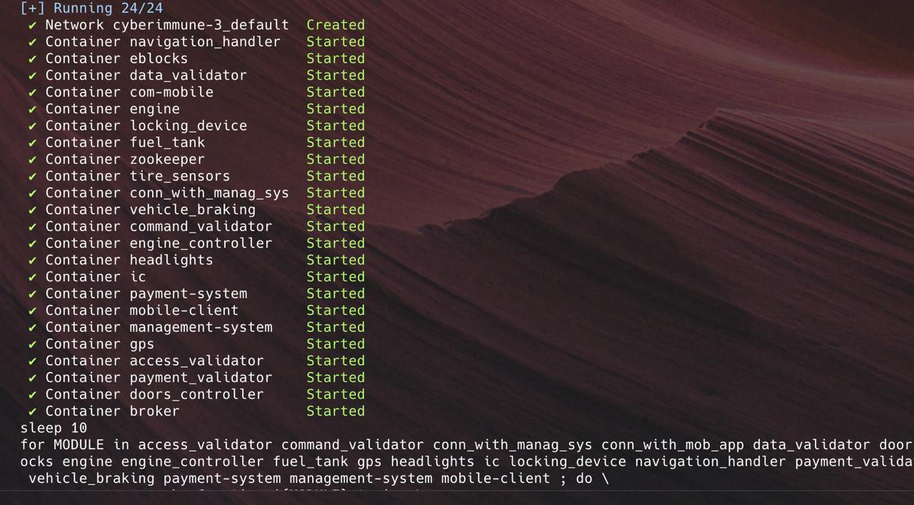

#### Обмен информацией
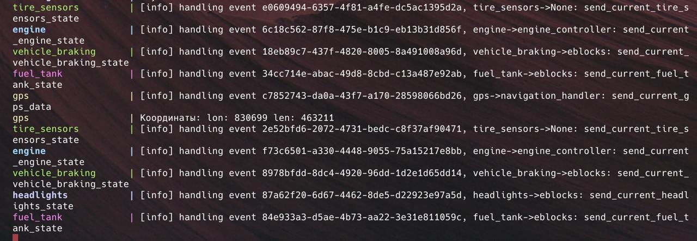

#### Тесты
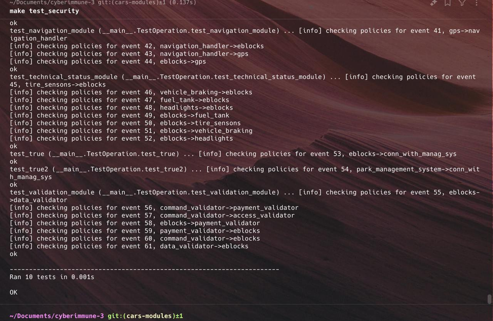

